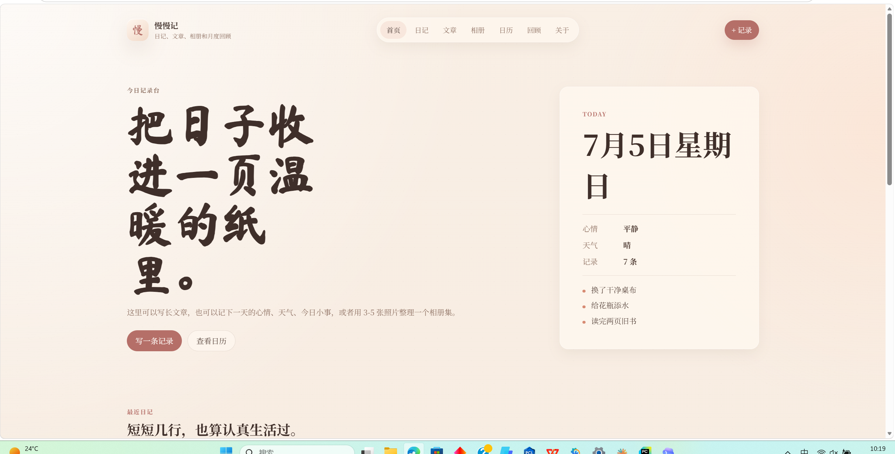
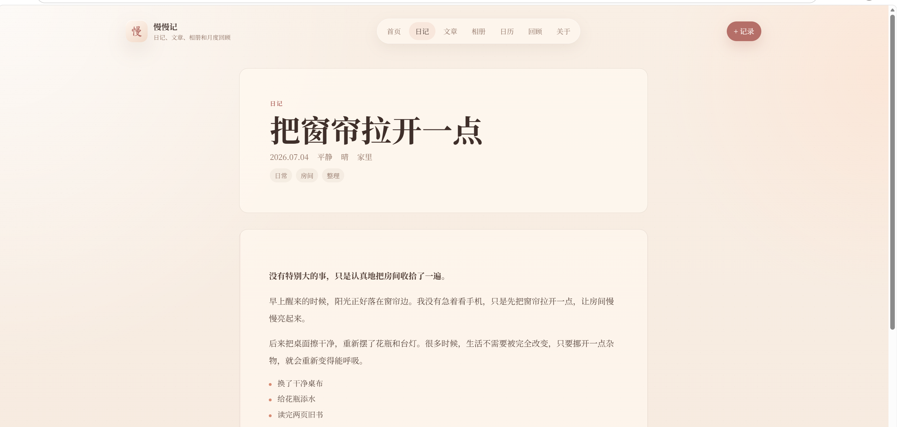
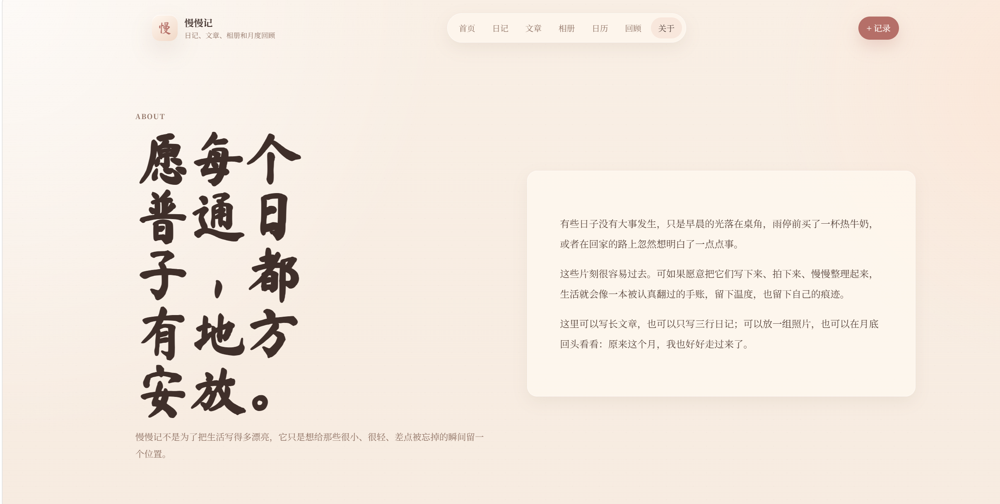

# 慢慢记

一个暖色纸感的手账日记系统，用来记录日记、长文章、相册集和月度回顾。

## 页面预览

### 首页



### 日记详情页



### 关于页



## 页面

- `index.html`：今日记录台，包含首页总览、最近日记、精选文章、最近相册、本月回顾
- `diary.html`：日记列表，支持搜索和心情筛选
- `posts.html`：文章列表，支持搜索和分类筛选
- `post.html`：文章 / 日记详情页
- `albums.html`：相册集列表，支持搜索和标签筛选
- `album.html`：相册集详情页，每组 3-5 张照片
- `calendar.html`：月历视图，按日期查看记录
- `review.html`：月度回顾
- `publish.html`：写记录，支持日记、文章、相册集和草稿
- `about.html`：关于页面

## 数据

主要数据在 `blog-data.js`：

- `type: "diary"`：日记
- `type: "post"`：文章
- `type: "album"`：相册集

发布页新增的内容会保存在当前浏览器的 `localStorage`，适合本地预览和个人使用。

## 运行

可以直接打开 `index.html`。

也可以启动静态服务：

```bash
python -m http.server 8000
```

然后访问：

```text
http://localhost:8000
```
